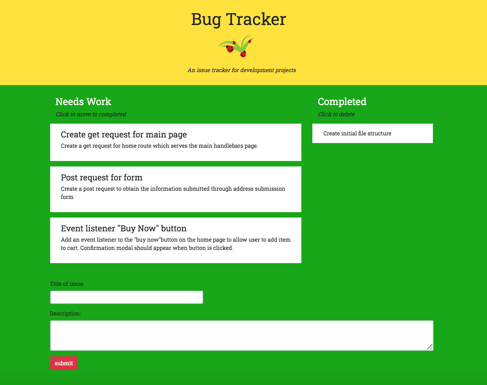

# Bug Tracker

[Link to deployed app](https://thawing-dawn-74525.herokuapp.com/)

## Description
Full stack application which allows users to keep track of bugs in their project code. App is connected with a database so multiple users can use the tracker for one project.

## Installation
Run `npm i` to install dependencies. To run the application on your machine, load the schema.sql in mySQL and run `npm run watch` to start the server. 

## License
Licensed under the [WTFPL](http://www.wtfpl.net/about/) license.